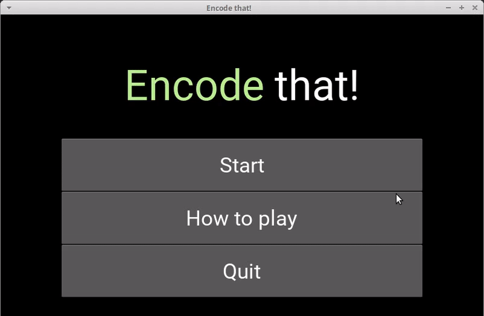
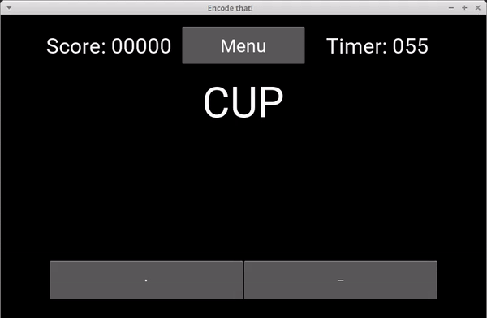

# Encode that! 
A simple game that test and practice your Morse code skills with Python 3 and Kivy GUI. 

(*10.009 The Digital World* Final Project)


## Overview

Learning Morse code through reading and the conventional practice may be boring to some, therefore this game is created to gamify and compliment one's learning experience, allowing one to have a more enjoyable learning experience. 




## Dependencies

The following libraries are required:

- Kivy v1.11.1
- libdw

If not, install the required dependencies via ```pip3 ```:

```bash
$ pip3 install libdw kivy==1.11.1
```


## Gamplay

### Starting the game

Start the game from the extracted directory:

```bash
$ python3 encodethat.py
```

### Objectives

Encode as many words as Morse Code as possible within 1 minute, where each correct character awarding 10 points.

### Duration

The game would last for 1 minute by default, but could be modified in the game configuration. 

### Controls

There are 2 ways to input the Morse code, which are:

- Buttons: Press on the respective buttons below for either a *dot* or a *dash*.
- Keyboard: 
  - Left Arrow Key: *Dot* input
  - Right Arrow Key: *Dash* Input

### Instructions

The basic gameplay instructions could be found by pressing the *How to play* button.


### Pausing

The game could be paused by pressing the menu button located at the top of the game screen. From there, the player would be able to either resume the game or return to the main menu.




## Technical Details

> More details of the code are in this section.

### Brief Overview

The user would entered the corresponding Morse code for the specific character, where a timeout would be set to rest the Morse code entered by the user. Once the timeout is reached, the Morse code would be encode as follows:

- Dot -> 0
- Dash ->1

After which, a "2" would be appended to the end of the string as a delimiter (To mark the end of the Morse code). For example, a "-.-" would be encoded as "1012". The encoded string would then be sent to the MorseSM class, which would decode the given sequence and return the corresponding character. If the given encoded string is given, the error returned would be ignored and no new character would be appended to the User's types text.

The section below would further elaborate the classes and the functions utilized in the game.

### *class* encodeThat()

Inherited from Kivy *App class*, serve as the starting point of the game with the inclusion of the screen manager.

---

### *class* MainScreen()

Inherited from Kivy *Screen class*, serves as the default screen of the game with a BoxLayout.

#### *UI Handler*

**populateUI()**: Populate the screen with the game title & 3 buttons to either start the game, read the game instructions or to quit the game.

**toNextScreen(direction, page)**: Assist in screen transition.

#### *Button Callback*

> The instance argument is returned by Kivy

**startGameScreen(instance)**: Switches to the Main Game screen, sliding left.

**startHowTo(instance)**: Create and show the instruction popup dialogbox.

**closeHTB(instance)**: Close the instruction popup dialogbox.

**exitGame(instance)**: Exit the game

---

### *class* GameScreen()

Inherited from Kivy *Screen class*, serves as the main game screen of the game with a BoxLayout.

#### *UI Handler*

**addTopSection():** Add top section of the game GUI.

**addMidSection():** Add middle section of the game GUI.

**addBtmSection():** Add the bottom section of the game GUI.

**setPlayerKeys(str text):** Setup time spacing tracking and display the entered keys (dot dash pattern).

**setUserText(str text,Label lbl):** Set the label text as the keys (dot/dash) entered by the user.

**setScoreTimerText(score,timeRm):** Set the *Score* and *Timer* text.

**resetTypedText(Label[] lblList):** Set the list of Label, *lblList*, as empty.

**showKeyGoBtn(showKeys, showGo):** Set the Dot, Dash, Go button visibility and whether the buttons are enabled.

**appendInText(lblName, strToAdd, numZero):**  Set text with digit formatting, used to set the score and timer countdown.

#### Game State

**resetGame():** Reset the game state, timers scores to initial state.

**pauseGameState(stateActive):** Set the menuPause game state, which would determine whether to pause the timer.

#### Keyboard Binding

> The instance argument is returned by Kivy

**_bindKeyboard():** Bind the keyboard to the game so as to enable the game to detect key entered when the game is running.

**_keyboard_closed():** Function to unbind from the keyboard.

**_on_keyboard_down(keyboard, keycode, text, modifiers):** Callback function for keyboard input, used to determine the left arrow key (dot) or right arrow key (dash) is entered.

#### *Button Callback*

> The instance argument is returned by Kivy

**dotPress(instance):** Calls setPlayerKeys() with the argument "•", signals that dot has been entered. (Either by button press or left arrow keypress).

**dashPress(instance):** Calls setPlayerKeys() with the argument "—", signals that dash has been entered. (Either by button press or right arrow keypress).

**goPress(instance):** Start pre game countdown before the start of the main game.

**pausePress(instance):** Pause the game timer and shows a paused dialog box. Users could then resume the game or return to main menu.

**resumePress(instance):** Triggered when resume button of paused dialog box is pressed. Resumes the game timer.

**quitPress(instance):** Triggered when quit button of paused dialog box is pressed. Returns the user to the main menu.

#### *Data Handling*

**_loadConfig():** Load the game configuration file from *res/game.cfg* as a dictionary.

**updateHighscore(new_score):** Opens and update the *res/game.cfg* high score when a new high score is achieved.

**loadWordList():** Opens and load the wordlist from *res/wordlist.txt* to be used for the user to encode.

**pickRandomWord():** Select a random word from the wordlist for the the user to encode.

**nextWord():** Set the text of the Test Word that is returned from the pickRandomWord() function, and resets the entered keys.

**decodeString(targetString):** Encodes the string entered by the user and calls the MorseSM().getCharacter() function, which returns the decoded character.

**checkCorrect(testWordStr, inputStr, decodedChar):** Character checking function, used to check whether the user entered character matches the character of the Testword at the same string position. 

- If the user's character matches the Testword character at the same string position, **10 points** would be added to the total score. The entire Testword would be in green.
- If the user's character does not match the Testword character at the same string position, **no points** would be added to the total score. The entire Testword would be in red.

#### *Timers*

> *dt* argument is returned by Kivy *Clock* class, contains the duration since last call (seconds).

**countdownTime(self,tm):** To schedule a Clock Callback every 1 second.

**onUpdateTime(dt):** Callback function for *countdownTime()* function. Used to keep track of the time left for either the pre-game countdown timer or the main game timer.

**trackBtnTime():** Called when any button is pressed, which would start a clock event of  checkButtonInterval milliseconds as specified in the game configuration.

**btnTimeTrackUpdate(dt):** Callback function for *reackBtnTime()* function. Used Used to keep track of how long was any key was pressed and to send the string to be encoded as Morse Code.

**loadNextWord(dt):** Callback function for *checkCorrect()* function, which would call a new word to be shown 1 second after the entire word has been typed out by the player.

**cancelTimer(timerName):** Cancels/Unschedule the respective timer as given in *timerName* if it is not empty.

---

### *class* MorseSM()

Inherited from libdw *sm.SM class*, utilize to decode the given Morse Code sequence, initializes by creating a Morse Code pattern dictionary.

**get_next_values(state, inp):**  Returns the state and input from the given *state* and *inp* argument, which is determined by the Morse Code pattern dictionary. The transduction would be stopped when the state is "*".

**getCharacter(codeStr):** Returns the decoded alphabetic character of the given Morse code encoded string *codeStr*. Various error messages would be returned if:

- The string is more than 6 characters.
- Certain parts of the string is non-numeric.
- The string is missing the back delimiter, that is represented as "2".


## Known Issues

- The keyboard input may not recognized immediately after the game starts.


## License

Licensed under the [GNU General Public License v3.0](LICENSE).